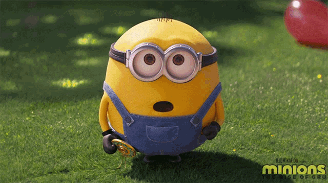
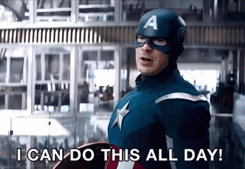

I'm a self thaught software engineer. Just a normal dood with mediocre expectations on life.

#### My alter ego

Every day i go to work at 10 - 10.30 in the morning, login to my laptop and start coding. 
It was an interesting job with high expectations and short deadlines.

Designers were responsible for what to be done, marketers were responsible for when to be done, making those what and whens to that and thens was my responsiblity.

Going to work getting my job done and returning home(just to sleep), was my routine and i was good at it, until that one day.

#### My biggest fear

My work life was going busy but peaceful. I went to work without realising, the day that will change my life forever has come. 

It was the month of february, some new employees have joined the company.

And there she was... The One (atleast i thought so) - one of the new employees.

The perfect way to describe her, "waaaaaaaaayyyyyyy out of my league".

She entered the workspace, I can still remember the way she walked past me crossing my table.
I was so happy to go to work just to see her.

She knew about it, but couldn't care less.

>I was looking for her in every girl i see, while she was busy ignoring my existence.

    Perfectly balanced as everything should be.

##### My daily schedule
Go to work -> look at her from a distance -> make-up fake scenarios in my head -> fly high in imagination -> realise i'll never get her -> get depressed -> go home.

#### With great power, comes great pain

Soon a delightful thing happened, some of her friends were referencing me to tease her and i was on a 52 week high.

One day i was sitting at a viewing distance from her and her group.

So this guy friend of hers started teasing her and the group joined him. Immediately he stops them by saying these exact words "Hey guys enough enough, stop it. She's gonna cry again".

"Again? did he say again? 🤯. She cried? because of me?"
The worst has happened, to get irritated is something, but to **cry**.

That is when i realised i have this super power

I can make a girl cry, just by looking at her.

I have this super power, which is of no use to me or anyone else but none the less i'm still a super hero😎.

