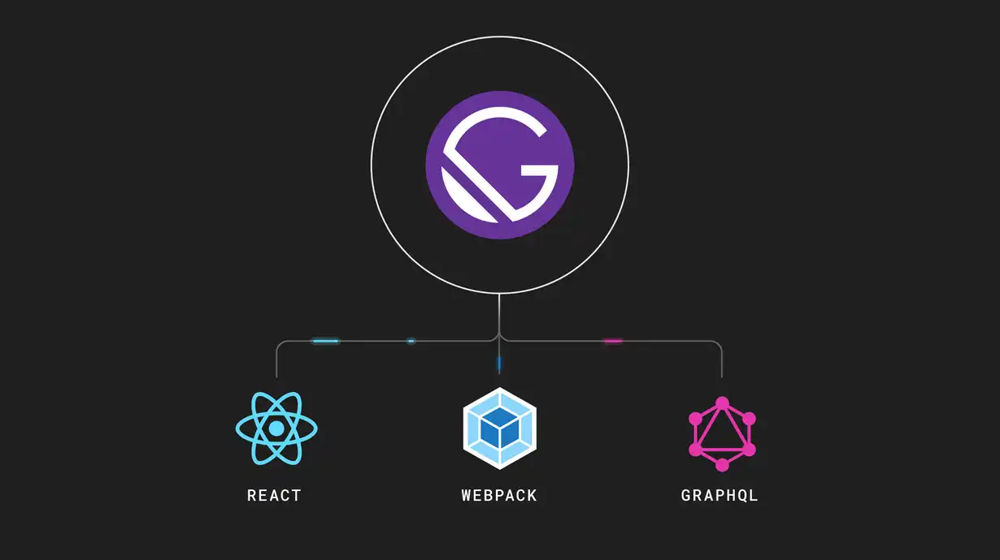

I'm sure I'll write a lot more interesting things in the future.

Okay so what is gatsby? it's a [1925 novel](https://www.wsfcs.k12.nc.us/cms/lib/NC01001395/Centricity/Domain/7935/Gatsby_PDF_FullText.pdf) by American writer F. Scott Fitzgerald?  
But [this awesome post](https://www.mparticle.com/blog/what-is-gatsby) here says otherwise.

> Gatsby is a React-based open-source framework for creating websites and apps.
> It's great whether you're building a portfolio site or blog, or a high-traffic e-commerce store or company homepage.



## I use gatsby at work and i love it

```js
import { StaticQuery, graphql, Link } from 'gatsby'
```

> Why did we choose gatsby, when going with Wordpress is so much simpler?

```markdown
1. Needed a website and needed it real quick.
2. It should be unique and theme matching to our company's brand.
3. Developer friendly and performant out of the box.
```

Three important points when you decide which way to go, especially when you like to build a brand from the ground up.

Needless to say the abundance of support from the community, as react is the #1 favorite frontend framework that developers all around the world love.

## Is it really Blazing fast?

As mentioned in their official site, **"is it really that fast? 🤔".**

I had the doubt, but i had to make sure myself and the results were amazing.

Normally server-side-rendered sites are a little bit faster than conventional sites, but **statically generated sites** are even faster.

All pages, templates and components are built, split and mapped during **Build** time, which i will be explaining later.

```markdown
- Gatsby provides a **Link** component, which you use on internal links.
  It is optimized in a way to make route change look like magic.

- It prefetches the linked page content on hover, no loading...
  **out of the box support** just like that no configuration needed.
```

---

---

---

Event though these pages are seperate, once the homepage is loaded, react takes over and makes the static pages into a single app and makes it look flawless and smooth like a web app.

It's a little bit of this, little bit of that. Everything is starting to make sense now...

But still what all can we do with this framework?

                                           to be continued...
