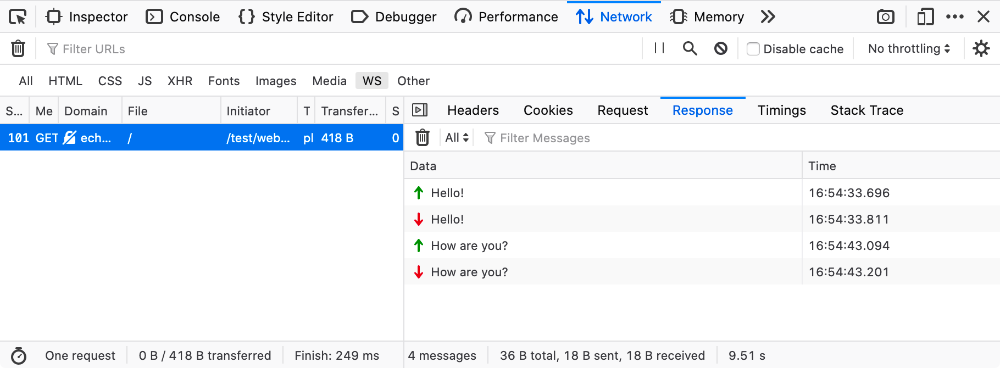

Websocket is a two way connection created between server and client; Unlike http requests, which is one way.

Two way connection means, the client and server can send and receicve data continously back and forth in real-time.

The websocket connection usually comes with a inactivity timeout. The connection stays live as long as the server receives some request from the client.

    20 seconds for ElevenLabs' inactivity timeout, or a 30-second timeout for AWS API Gateway WebSocket APIs

Websocket "Heartbeat":

So in order to keep the connection alive, a industry standard practice called "Hearbeat" is being followed.

A request will be sent to the server from the client, every 20 seconds once. This keeps the connection alive, helps detect in case of diconnection and also helps to check the health of the connection, hence the name.

As mentioned earlier, this is a two way connection. Which means the server can push events to the client without being requested for one.

This will be very useful in multi-user collaborative environments. Every other user will be notified when any of the users makes some changes or does some action.

From the client, we create a new websocket connection as below

    let webSocket: WebSocket | null = new WebSocket("wss://domain.in");

      interface WebSocket extends EventTarget {
        readonly readyState: number

        close(code?: number, reason?: string): void
        send(data: string | ArrayBufferLike | Blob | ArrayBufferView): void

        onclose: ((this: WebSocket, ev: WebSocketEventMap['close']) => any) | null
        onerror: ((this: WebSocket, ev: WebSocketEventMap['error']) => any) | null
        onmessage: ((this: WebSocket, ev: WebSocketEventMap['message']) => any) | null
        onopen: ((this: WebSocket, ev: WebSocketEventMap['open']) => any) | null
      }

The websocket comes with

- a property to check the connection status - readyState,
- functions like send() and close()
- event callbacks like onclose(), onerror(), onmessage(), onopen() etc...

We can use the readyState property to handle any side effects or when to start sending messages to the server

    // possible values of readyState
    CONNECTING = 0, OPEN = 1, CLOSING = 2, CLOSED = 3

once the connection is open, Websocket.send(data) is used to make requests to the server

On the server, the websocket will be handled in a specific port of the server (configurable) and the server will be listening for messages/data from the client.

    const sockserver = new WebSocketServer({ port: 443 });

    sockserver.on("connection", (ws) => {
      ws.send("connection established");

      ws.on("message", (data) => {
        const { requestData, event, eventType } = JSON.parse(data);
        if (eventType === "ClientEvent") {
          switch (event) {
            case "Register":
              ws.send( JSON.stringify({ data: responseData }) );
              break;
            case "SendMessage":
              ws.send( JSON.stringify({ data: responseData }) );
              break;
            case "Unregister":
              ws.send( JSON.stringify({ data: responseData }) );
              break;
          }
        }
      });

      ws.on("erroe", () => console.log("websocket error"));

      ws.on("close", () => console.log("Client has disconnected!"));
    });

Similar to the client, WebSocketServer comes with functions like "send()", "close()", event callbacks for "connection", "error", "close", etc...

Pretty much similar, except a server can connect and interact with multiple connections all at once.

In order to acheive this, the server must be aware of all the users that are active and in session.

So usually once a user logs in the app, the client registers with the server, and the server responds with the available active users list during the time of registering. Also simultaneously all the registered active users gets notified about the new user.

And when the user leaves the app, the client sends a unregister event, so the server stops sending events/messages to that client.
Once unregistered successfully, Websocket.close() is called and the connection is disconnected.

FYI: [Whatsapp uses Websocket with MQTT(sub-protocol) for real time messaging](https://medium.com/@jayanththalla33/developer-blog-how-whatsapp-handles-real-time-messaging-and-why-messages-say-waiting-for-this-0c00231dbfe7)

What is MQTT? [check it here](https://www.geeksforgeeks.org/computer-networks/introduction-of-message-queue-telemetry-transport-protocol-mqtt/)
