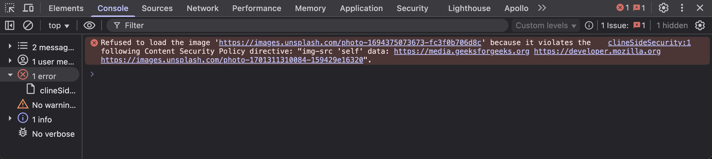

Front end (Client side) code is meant to be run on browsers, on a client machine of a random user.
Anyone with a internet connection can access it. When they interact with the UI, in-response the UI interacts with the backend.

Any input given by the user, will be saved in a database and in some cases will be served to other users;

For example consider a comment section, where one person's reply on a post is displayed to other users who see the post. If this comment has some executable script in it, almost anyone who simply visits the page gets attacked.

So it is necessary to make it as secure as possible, since even a small gap can bring down an entire product.

There are multiple ways to secure wbsites from attacks.

## 1. Sanitizing the inputs

As a first and most important precaution, all input fields in a site must be sanitized

What is sanitising? Sanitising is the process of stripping down the exectables like <code>\<script \/\></code>, Javacript:URL() or event handlers like onclick(), onfocus() etc... from a given input, to avoid SQL code injection and Cross site scripting.

Let's say you have a WYSIWYG/Rich-text editor in your site to get user input for a conversation in a ticket.
This html input once submitted, will be rendered as HTML in the list of conversations made. This conversation can have inline-images, tables, text content with inline styles etc...

React has a attribute "dangerouslySetInnerHTML" to render html in the DOM. To avoid XSS attacks, this html must be sanitized.

It is a best practice to do it before sending the input to BE, like below.

    {
      images: [],
      attachments: [],
      content: dompurify.sanitize(this.props.template) || ''
    }

and also before rendering in the DOM

    

[DOMPurify](https://www.npmjs.com/package/dompurify) is a Javascript library, that extensively sanitizes HTML.

## 2. Content Security Policy (CSP)

If you have experience building web apps, you probably must have heard about CORS(Cross origin resource sharing). So basically, it is a security measure to safegaurd data from unauthorised access. In order to share resource with other origins, you have whitelist them explicitly.

CSP comes under this category, this policy helps control/restrict, all the resources loaded in your web app/site using the domain they are served from. This helps in preventing XSS attacks on your site.
This response header must be present in every response from the server.

You have to include all the whitelisted domains in their respective directive: list of domains.

Meaning, there are multiple types of resources and each type has to mentioned in a one or more directive in csp. If the resource's domain is not mentioned in the CSP header, browsers just blocks it.

    default-src: 'self';
    script-src: 'report-sample' 'self' 'wasm-unsafe-eval' https://www.google-analytics.com/analytics.js https://www.googletagmanager.com/gtag/js assets.codepen.io production-assets.codepen.io https://js.stripe.com 'sha256-XNBp89FG76amD8BqrJzyflxOF9PaWPqPqvJfKZPCv7M=' 'sha256-YCNoU9DNiinACbd8n6UPyB/8vj0kXvhkOni9/06SuYw=' 'sha256-PZjP7OR6mBEtnvXIZfCZ5PuOlxoDF1LDZL8aj8c42rw=';
    script-src-elem: 'report-sample' 'self' 'wasm-unsafe-eval' https://www.google-analytics.com/analytics.js https://www.goog…usercontent.com firefoxusercontent.com profile.stage.mozaws.net profile.accounts.firefox.com developer.mozilla.org mdn.dev interactive-examples.mdn.mozilla.net interactive-examples.mdn.allizom.net wikipedia.org upload.wikimedia.org https://mdn.github.io/shared-assets/ https://mdn.dev/ https://*.google-analytics.com https://*.googletagmanager.com www.gstatic.com;
    manifest-src: 'self';
    media-src: 'self' archive.org videos.cdn.mozilla.net https://mdn.github.io/shared-assets/;
    child-src: 'self';
    worker-src: 'self';

This is a sample CSP response header from [MDN](https://developer.mozilla.org/en-US/docs/Web/HTTP/Guides/CSP)'s site.

If you need to load a image, let's say from "unsplash.com" _https://images.unsplash.com/photo-1701311310084-159429e16320_

This domain must be mentioned in img-src directive.

    img-src: 'self' https://images.unsplash.com/photo-1701311310084-159429e16320

'self' is to allow resource from same origin, and also note that i have added the complete URL of the image, specifying that only this image from unsplash is allowed.

If I load another image, from the same domain "unsplash.com" it will not be loaded _https://images.unsplash.com/photo-1694375073673-fc3f0b706d8c_

If you open, developer tools -> console you could see a error saying "Refused to load the image" because it violates the Content Security Policy

    img-src: 'self' https://images.unsplash.com

If I mention only the domain in img-src directive, any image from the domain will be loaded.

To visialise better, i have used the img-src above. It works almost the same for scripts, fonts, styles, js files etc...

You could check out all the directives available here...

<previewbox-link href="https://developer.mozilla.org/en-US/docs/Web/HTTP/Reference/Headers/Content-Security-Policy#fetch_directives"> </previewbox-link>
