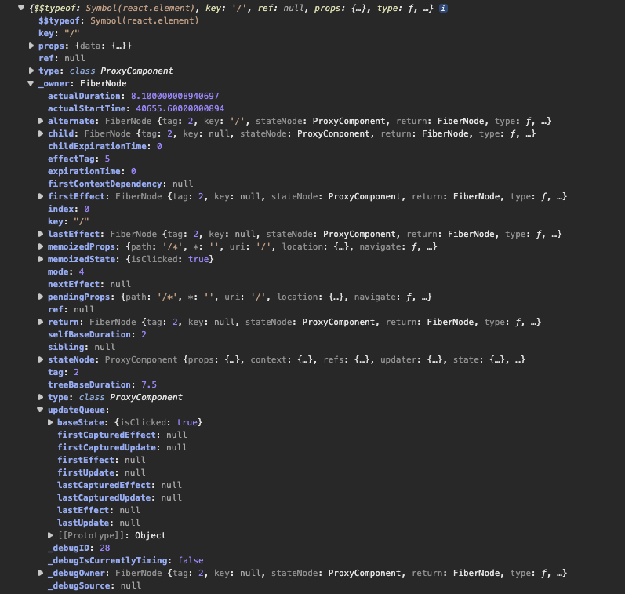

What exactly is a fiber object?

Each instance of a component is internally represented in React as a ‘Object’, and these Objects have a lot of properties that are used by React to keep track of things like state and props.

It stores crucial information about the component it represents.

A react component structured as below

      class IndexRoute extends React.Component {
        constructor(props) {
          super(props)
          this.state = { isClicked: false }
        }
        render() {
          const items = []

          if (!this.props.data) {
            return null
          }

          const { title, subtitle } = this.props.data.site.siteMetadata
          const posts = this.props.data.allMarkdownRemark.edges
          posts.forEach(post => {
            console.log(<Post data={post} key={post.node.fields.slug} />)
            items.push(<Post data={post} key={post.node.fields.slug} />)
          })

          return (
            <Layout>
              

                <Helmet>
                  <title>{title}</title>
                  <meta name="description" content={subtitle} />
                </Helmet>
                <button onClick={() => this.setState({ isClicked: true })}>
                  Click me
                </button>
                {this.state.isClicked && 
Clicked
}
                <Sidebar {...this.props} />
                

                  
{items}

                

              

            </Layout>
          )
        }
      }

will be represented as object, as shown below

This object is used internally by react to represent a element or node within the component tree.

These properties work together to manage rendering, updates, and debugging. Core ones like child/sibling/return form the tree structure, while effects and expiration handle scheduling.

## Let's breakdown some important properties:

1. <strong>$$typeof</strong>: This property is used to identify and differentiate React elements from regular JSON.

_Read the original pull request to understand the rationale why <cite>$$typeof</cite> should exist:_

<previewbox-link href="https://github.com/facebook/react/pull/4832?source=post_page-----ecfee15f875f---------------------------------------"> </previewbox-link>

According to "Sebastian Markbåge" who made this change, the primary motivation is to prevent XSS attacks in react_v0.14.

Since Symbols cannot be stored in JSON as Symbols are non-string, non-serializable primitives in JavaScript.
User input JSON, containing <cite>$$typeof</cite> with a symbol is not a possibility.

React will check element.$$typeof , and will refuse to process the element if it’s missing or invalid.

    /**
    * Verifies the object is a ReactElement.
    * See https://reactjs.org/docs/react-api.html#isvalidelement
    * @param {?object} object
    * @return {boolean} True if `object` is a ReactElement.
    * @final
    */
    export function isValidElement(object) {
      return (
        typeof object === 'object' &&
        object !== null &&
        object.$$typeof === REACT_ELEMENT_TYPE
      );
    }

These are the possible values for <cite>$$typeof</cite> in react:

    var symbolFor = Symbol.for;
    REACT_ELEMENT_TYPE = symbolFor('react.element');
    REACT_PORTAL_TYPE = symbolFor('react.portal');
    exports.Fragment = symbolFor('react.fragment');
    REACT_STRICT_MODE_TYPE = symbolFor('react.strict_mode');
    REACT_PROFILER_TYPE = symbolFor('react.profiler');
    REACT_PROVIDER_TYPE = symbolFor('react.provider');
    REACT_CONTEXT_TYPE = symbolFor('react.context');
    REACT_FORWARD_REF_TYPE = symbolFor('react.forward_ref');
    REACT_SUSPENSE_TYPE = symbolFor('react.suspense');
    REACT_SUSPENSE_LIST_TYPE = symbolFor('react.suspense_list');
    REACT_MEMO_TYPE = symbolFor('react.memo');
    REACT_LAZY_TYPE = symbolFor('react.lazy');
    REACT_BLOCK_TYPE = symbolFor('react.block');
    REACT_SERVER_BLOCK_TYPE = symbolFor('react.server.block');
    REACT_FUNDAMENTAL_TYPE = symbolFor('react.fundamental');
    REACT_SCOPE_TYPE = symbolFor('react.scope');
    REACT_OPAQUE_ID_TYPE = symbolFor('react.opaque.id');
    REACT_DEBUG_TRACING_MODE_TYPE = symbolFor('react.debug_trace_mode');
    REACT_OFFSCREEN_TYPE = symbolFor('react.offscreen');
    REACT_LEGACY_HIDDEN_TYPE = symbolFor('react.legacy_hidden');

## Fallback when symbol is not supported

The fallback solution is a plain well-known number.

    var REACT_ELEMENT_TYPE = 0xeac7;

<blockquote>
Why this number specifically? 0xeac7 kinda looks like “React”.
<cite> - Dan Abramov</cite>
</blockquote>

2.  <strong>key</strong>: Used during reconciliation to determine if a fiber can be reused when components are reordered

3.  <strong>type</strong>: Describes what kind of component this represents - for composite components it's the function/class, for DOM elements it's a string like "div"

4.  <strong>tag</strong>: Numeric identifier indicating the fiber type (FunctionComponent, ClassComponent, HostComponent, etc.)

below are the possible Numeric identifiers for tag property in react

        export const FunctionComponent = 0;
        export const ClassComponent = 1;
        export const HostRoot = 3; // Root of a host tree. Could be nested inside another node.
        export const HostPortal = 4; // A subtree. Could be an entry point to a different renderer.
        export const HostComponent = 5;
        export const HostText = 6;
        export const Fragment = 7;
        export const Mode = 8;
        export const ContextConsumer = 9;
        export const ContextProvider = 10;
        export const ForwardRef = 11;
        export const Profiler = 12;
        export const SuspenseComponent = 13;
        export const MemoComponent = 14;
        export const SimpleMemoComponent = 15;
        export const LazyComponent = 16;
        export const IncompleteClassComponent = 17;
        export const DehydratedFragment = 18;
        export const SuspenseListComponent = 19;
        export const ScopeComponent = 21;
        export const OffscreenComponent = 22;
        export const LegacyHiddenComponent = 23;
        export const CacheComponent = 24;
        export const TracingMarkerComponent = 25;
        export const HostHoistable = 26;
        export const HostSingleton = 27;
        export const IncompleteFunctionComponent = 28;
        export const Throw = 29;
        export const ViewTransitionComponent = 30;
